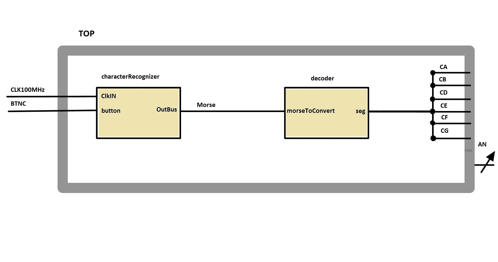

### Team members

* David Bartoň (initial idea of function blocks; signalTransmitter.vhd)
* Šimon Bárta (signalTransmitter.vhd; top.vhd; tb_MorseDecoder.vhd)
* Jakub Fojtík (7seg_decoder.vhd; tb_MorseDecoder.vhd)

## Theoretical description and explanation

Our assignment was to do morse code transmitter and reciever using Nexys A7-50T development board in VHDL language. We wanted to use one button that would send 1 for HIGH and 0 for LOW, then using time intervals of 250 ms. One interaval of 250 ms should be dot and space between, 1000 ms should be dash. These characters (dot, dash, space) are then written into array of 4 double digits. The array is then 8-bits long and each two digits represents sign: 00 = nothing, 01 = dot, 10 = dash. These 8-bit numbers are then used in our case-when statement to light-up correct letter from alphabet on 7-segment display.

## Hardware description of demo application

By pressing BTNC (middle button) on board bz morse code standarts, shift register in our code should be able to recognize our letter and display it on 7-segment display. We were not able to implement input to our board so we can't show the letters by generator. 

## Software description

Our software should be able to remember 8-bit number using shift registers in characterRecognizer and then output it in 7-segment display.

### Component(s) simulation

We were not able to simulate project.

## Instructions

1. press middle button according to standart morse code
2. wait for letter to show up on display

## References

1. [Morse code translated to 7-segment display](https://fakoo.de/en/siekoo.html)
2. [Better shift register than our first](https://www.instructables.com/Basys-3-Morse-Decoder/)
3. [Idea of timing and using shift registers](https://www.researchgate.net/publication/305379385_Morse_code_decoder_design_in_VHDL_using_FPGA_Spartan_3E_development_kit)
